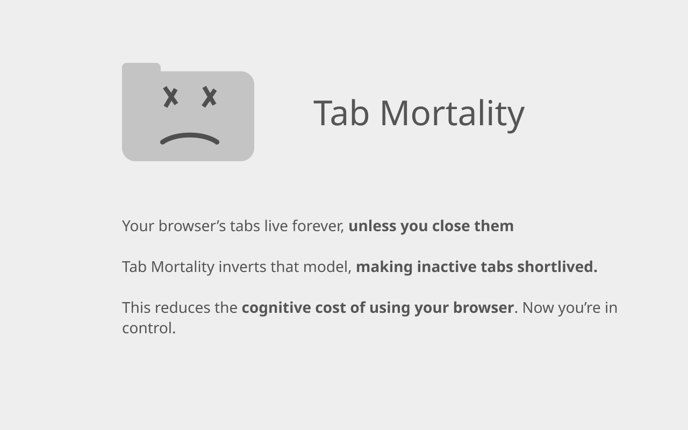

# Tab Mortality ☠

Tab Mortality is a browser extension that limits the lifespan of tabs. Lingering tabs are closed to preseve your attention.

This returns control to YOU. No longer do open tabs dictate what to focus on.

## Things planned:

- [ ] Exception list (tabs that should always stay open)
- [ ] 'App mode' where certain domains are limited to a single open tab. (Looking at you, Amazon)
- [ ] UI to explore and export closed tabs to apps like Roam, Evernote.

